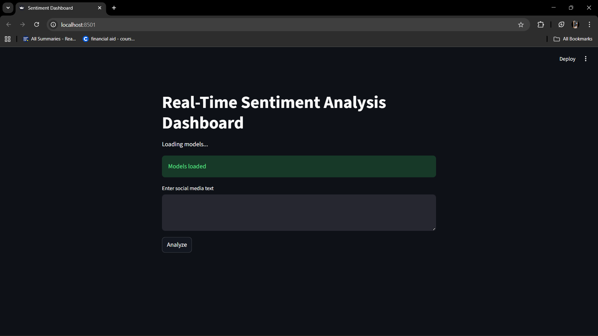
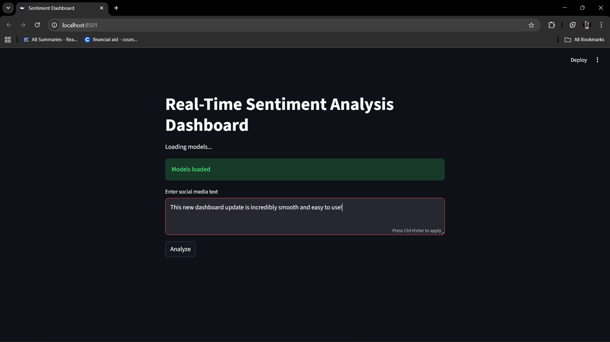
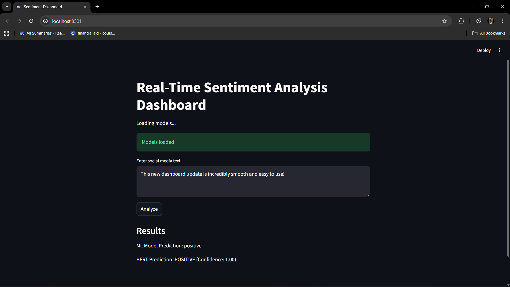

<div align="center">

# 🎭 Sentiment Analysis Dashboard

**A real-time sentiment analysis application combining Machine Learning and Deep Learning**

[](https://python.org)
[](https://streamlit.io)
[](https://huggingface.co)
[](https://scikit-learn.org)

[Features](#-features) • [Installation](#-installation) • [Usage](#-usage) • [Screenshots](#-screenshots) • [License](#-license)

</div>

---

## 📖 About

This project is a comprehensive sentiment analysis dashboard that leverages both traditional **Machine Learning** (Logistic Regression with TF-IDF) and modern **Deep Learning** (BERT Transformer) to analyze the sentiment of social media text in real-time. Users can input any text and instantly receive sentiment predictions from both models, allowing for comparison and validation of results.

---

## ✨ Features

| Feature | Description |
|---------|-------------|
| 🔀 **Dual Model Architecture** | Compare predictions from ML (Logistic Regression) and BERT models side-by-side |
| ⚡ **Real-Time Analysis** | Instant sentiment predictions through an interactive Streamlit dashboard |
| 📊 **Confidence Scores** | BERT model provides probability scores for predictions |
| 🔧 **Complete Pipeline** | End-to-end workflow from data collection to deployment |
| 🐦 **Twitter Scraper** | Built-in scraper to collect social media data |
| 📝 **Text Preprocessing** | Automated cleaning, normalization, and stopword removal |

---

## 📁 Project Structure

```
sentiment_project/
│
├── 📄 app.py                 # Streamlit dashboard application
├── 📄 requirements.txt       # Project dependencies
├── 📄 README.md              # Documentation
├── 📄 .gitignore             # Git ignore rules
│
├── 📂 assets/                # Screenshots and images
│
├── 📂 data/
│   ├── 📂 raw/               # Raw tweet data
│   └── 📂 processed/         # Cleaned data ready for training
│
├── 📂 models/
│   ├── 📂 bert_model/        # BERT model files
│   └── 📄 ml_model.pkl       # Trained ML model + vectorizer
│
├── 📂 notebooks/             # Jupyter notebooks for experimentation
│
└── 📂 src/
    ├── 📄 scraper.py         # Twitter data scraper
    ├── 📄 preprocess.py      # Data cleaning pipeline
    ├── 📄 train_ml.py        # ML model training
    ├── 📄 train_bert.py      # BERT model training
    └── 📄 predict.py         # Prediction module with CLI
```

---

## 🚀 Installation

### Prerequisites

- Python 3.8 or higher
- pip (Python package manager)
- Git

### Step-by-Step Setup

**1. Clone the repository**

```bash
git clone https://github.com/agarwalaman598/sentiment_project.git
cd sentiment_project
```

**2. Create a virtual environment**

```bash
python -m venv venv

# Windows
venv\Scripts\activate

# macOS/Linux
source venv/bin/activate
```

**3. Install dependencies**

```bash
pip install -r requirements.txt
```

**4. Download NLTK data**

```bash
python -c "import nltk; nltk.download('stopwords')"
```

**5. Download the dataset**

Download the [Sentiment140 dataset](https://www.kaggle.com/datasets/kazanova/sentiment140) from Kaggle and place it in `data/raw/` folder.

---

## 📦 Dependencies

| Package | Purpose |
|---------|---------|
| `streamlit` | Web dashboard framework |
| `pandas` | Data manipulation |
| `numpy` | Numerical operations |
| `scikit-learn` | ML model training |
| `transformers` | BERT model |
| `torch` | Deep learning backend |
| `joblib` | Model serialization |
| `nltk` | Text preprocessing |
| `snscrape` | Twitter data collection |

---

## 🔧 Usage

### Quick Start

Run the dashboard directly:

```bash
streamlit run app.py
```

Open your browser at `http://localhost:8501`

### Complete Workflow

<details>
<summary><b>Step 1: Data Collection (Optional)</b></summary>

Scrape tweets for a specific keyword:

```bash
python src/scraper.py
```

Edit `scraper.py` to change the search keyword or tweet limit.

</details>

<details>
<summary><b>Step 2: Data Preprocessing</b></summary>

Clean and preprocess the raw data:

```bash
python src/preprocess.py
```

This will:
- Remove URLs, mentions, and hashtags
- Convert text to lowercase
- Remove special characters and stopwords
- Save cleaned data to `data/processed/cleaned.csv`

</details>

<details>
<summary><b>Step 3: Train ML Model</b></summary>

Train the Logistic Regression model:

```bash
python src/train_ml.py
```

This will:
- Train a TF-IDF + Logistic Regression pipeline
- Save the model to `models/ml_model.pkl`
- Print classification metrics

</details>

<details>
<summary><b>Step 4: Run Dashboard</b></summary>

Launch the Streamlit application:

```bash
streamlit run app.py
```

</details>

<details>
<summary><b>Alternative: CLI Prediction</b></summary>

For command-line predictions:

```bash
python src/predict.py
```

</details>

---

## 🖼️ Screenshots

<div align="center">

### Dashboard Interface



### Model Loading



### Sentiment Analysis Results



</div>

---

## 🤖 Model Details

### Machine Learning Model

| Component | Details |
|-----------|---------|
| **Algorithm** | Logistic Regression |
| **Vectorizer** | TF-IDF (5,000 max features) |
| **Labels** | Negative, Neutral, Positive |
| **Training Data** | Sentiment140 (1.6M tweets) |

### Deep Learning Model

| Component | Details |
|-----------|---------|
| **Architecture** | BERT (DistilBERT) |
| **Pre-trained Model** | `distilbert-base-uncased-finetuned-sst-2-english` |
| **Framework** | HuggingFace Transformers |
| **Output** | Label + Confidence Score |

---

## 📊 Dataset

### Sentiment140

This project uses the **Sentiment140** dataset — one of the largest publicly available sentiment analysis datasets.

| Property | Details |
|----------|---------|
| **Source** | [Kaggle - Sentiment140](https://www.kaggle.com/datasets/kazanova/sentiment140) |
| **Original Source** | Stanford University |
| **Size** | 1.6 million tweets |
| **Labels** | 0 (Negative), 2 (Neutral), 4 (Positive) |
| **Format** | CSV (Latin-1 encoding) |

---

## 🛠️ Tech Stack

<div align="center">

| Frontend | Backend | ML/DL | Data |
|:--------:|:-------:|:-----:|:----:|
|  |  |  |  |
| | |  |  |
| | |  | |

</div>

---

## 🤝 Contributing

Contributions are welcome! Here's how you can help:

1. **Fork** the repository
2. **Create** a feature branch (`git checkout -b feature/AmazingFeature`)
3. **Commit** your changes (`git commit -m 'Add AmazingFeature'`)
4. **Push** to the branch (`git push origin feature/AmazingFeature`)
5. **Open** a Pull Request

---

## 📄 License

This project is licensed under the **MIT License** — see the [LICENSE](LICENSE) file for details.

```
MIT License

Copyright (c) 2026 Aman Agarwal

Permission is hereby granted, free of charge, to any person obtaining a copy
of this software and associated documentation files (the "Software"), to deal
in the Software without restriction, including without limitation the rights
to use, copy, modify, merge, publish, distribute, sublicense, and/or sell
copies of the Software, and to permit persons to whom the Software is
furnished to do so, subject to the following conditions:

The above copyright notice and this permission notice shall be included in all
copies or substantial portions of the Software.
```

---

## 👤 Author

**Aman Agarwal**

[](https://github.com/agarwalaman598)

---

<div align="center">

### ⭐ Star this repository if you found it helpful!

Made with ❤️ by [Aman Agarwal](https://github.com/agarwalaman598)

</div>
